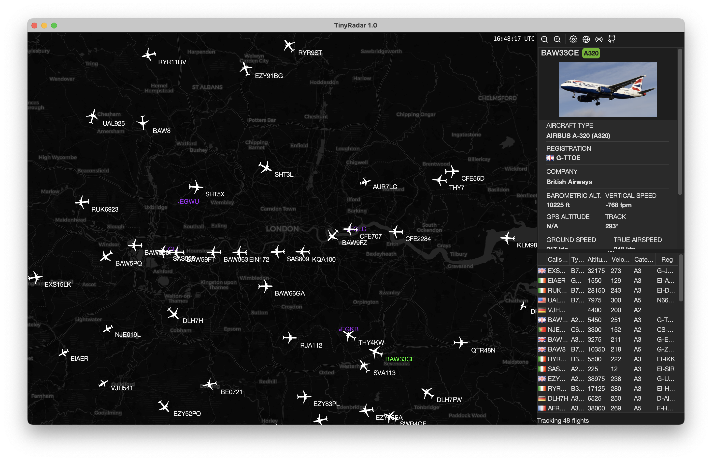

## TinyRadar

[](https://github.com/MasterFlomaster1/tinyradar/actions/workflows/build.yml)


### Usage

1. Download the latest release JAR file
2. ```bash
   java -jar tinyradar.jar

### Screenshots
<p align="center">
  
</p>

<p align="center">
  
</p>
